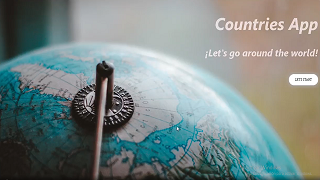
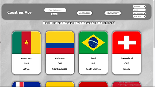
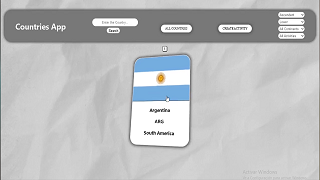
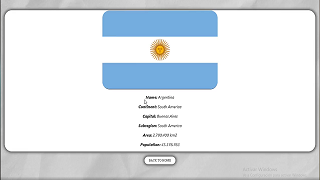
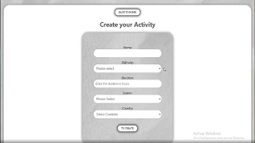

<h1 align="center">Hi, I'm Yeison👋, a passionate frontend developer👨🏻‍💻💻⚡</h1>

- 📝 I’m currently learning **TypeScript and React Native.**

- 📩 How to reach me **rodriguezyj.rodriguez@gmail.com**

<h2 align="left">📎Connect with me</h2>

  
<h2 align="left">🚀Skills</h2>

           

<h2 align="left">📌My proyects</h2>

  <h4 align="left">🌎Countries App</h4>
  
 
    
    
    
    
    
  

