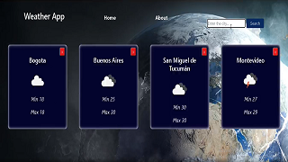

<h2 align="center">Hola👋, cómo estás?, soy Yeison, un Desarrollador Web Fullstack con orientación al Frontend👨🏻‍💻💻⚡</h2>

- 📝 Actualmente estoy aprendiendo **React Native y PHP** y reforzando **NodeJS y ReactJS. en general**
- 📩 Contáctame **rodriguezyj.rodriguez@gmail.com**
  
<h2 align="left">🚀Habilidades</h2>

           

<h2 align="left">📌Mis Proyectos</h2>
  <h3 align="left">🌎Countries App</h3>
  
<strong>Tecnologías:</strong> ReactJS, HTML, CSS modules, NodeJS, Express, Sequelize and PostgreSQL.

  
 
    
    
    
    
    
  

  
  <h3 align="left">🌦️Weather App</h3>
  
<strong>Tecnologías:</strong> ReactJS, HTML, CSS modules.

  
 
    
    
    
    
  

  
<h2 align="left">📎Conectate conmigo</h2>

  

 

    
    

